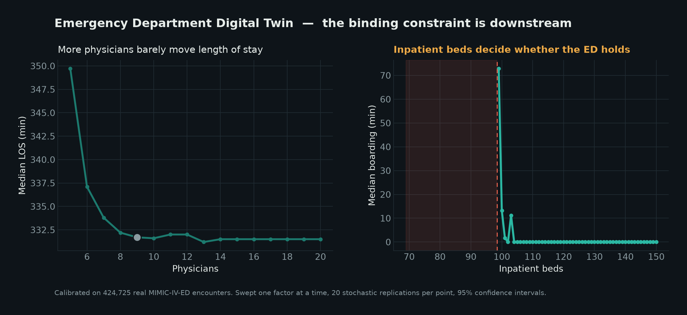
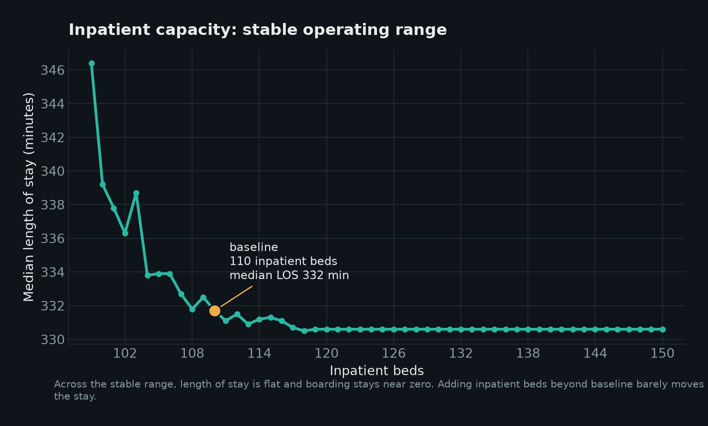
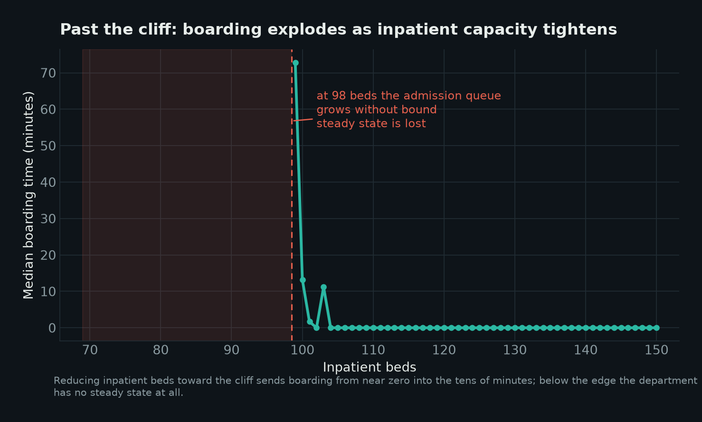

<div align="center">

# Emergency Department Digital Twin

### A calibrated discrete event simulation that finds the real constraint on emergency department flow

**The bottleneck is not the doctors. It is the beds upstairs.**

[](https://ed-twin.vercel.app)
[](https://physionet.org/content/mimic-iv-ed/)
[](https://simpy.readthedocs.io)
[](https://nextjs.org)
[](#license)

<br/>



<br/>

### [▶ Open the interactive model](https://ed-twin.vercel.app)

</div>

---

## At a glance

> A 20 second read of the entire project.

- 🚑 **Problem.** Emergency departments add doctors and beds to fix crowding, and patients still wait. The real constraint is usually somewhere no one is looking.
- 🧠 **Solution.** A digital twin of an emergency department, built as a discrete event simulation and calibrated on 424,725 real visits, that lets you move the levers a real department would move and watch the consequences.
- 📈 **Key insight.** Across the realistic operating range, adding physicians or emergency department beds barely changes length of stay. Inpatient bed capacity alone decides whether the department stays stable or collapses.
- ⚙️ **Stack.** Python and SimPy for the simulation, Next.js, React, and TypeScript for the interactive front end, hand authored SVG for the visuals.
- 🌐 **Live demo.** [ed-twin.vercel.app](https://ed-twin.vercel.app)

---

## Project highlights

✔ Interactive emergency department digital twin
✔ Calibrated on 424,725 real ED encounters
✔ MIMIC-IV-ED v2.2
✔ Process based discrete event simulation
✔ Built on SimPy
✔ 190 configuration parameter sweep, swept one factor at a time
✔ 20 stochastic replications per configuration, with 95 percent confidence intervals
✔ Automatic stability detection that names the saturated resource
✔ Guided walkthrough that narrates the finding with live numbers
✔ Decision support that reads the operating point and names the binding lever
✔ Live patient flow visualization with propagating congestion

---

## Table of contents

1. [Interactive demo](#interactive-demo)
2. [See it in action](#see-it-in-action)
3. [Key findings](#key-findings)
4. [Overview](#overview)
5. [Why this problem matters](#why-this-problem-matters)
6. [Research question](#research-question)
7. [Simulation methodology](#simulation-methodology)
8. [Digital twin architecture](#digital-twin-architecture)
9. [Calibration methodology](#calibration-methodology)
10. [Technologies used](#technologies-used)
11. [Repository structure](#repository-structure)
12. [Installation](#installation)
13. [Running locally](#running-locally)
14. [Future work](#future-work)
15. [Acknowledgements](#acknowledgements)
16. [License](#license)

---

## Interactive demo

**[https://ed-twin.vercel.app](https://ed-twin.vercel.app)**

The live application is the fastest way to understand the result. Open it and try moving the system yourself:

- **Reduce inpatient beds from 110 toward 98** and watch boarding climb, then watch the department lose its steady state entirely.
- **Increase physician staffing across its full range** and notice that length of stay barely moves.
- **Compare interventions** by switching levers and reading the operational verdict on the right.
- **Take the guided walkthrough,** which makes the full argument in five steps using numbers pulled live from the simulation.

No data is simulated in your browser. The application serves precomputed, aggregated results from the simulation runs, which keeps it fast and keeps the methodology reproducible.

---

<!-- See it in action: record docs/images/demo.gif later (inpatient lever crossing the cliff), then uncomment.


 -->

---

## Key findings

All numbers below come directly from the calibrated sweep and are reproducible from the committed data.

> **The binding constraint is downstream inpatient capacity, not emergency department staffing and not emergency department beds.**

**Baseline.** With 9 physicians, 45 emergency department beds, and 110 inpatient beds, the department is stable. Median length of stay is about 332 minutes, boarding is effectively zero, and utilization sits at 48 percent for physicians, 39 percent for emergency department beds, and 89 percent for the inpatient ward.



**Physicians are not the binding constraint.** Raising physician staffing across its full range moves median length of stay by under a minute. At baseline, physicians run at 48 percent utilization, far below saturation. They become binding only if staffing is cut below a floor near 5 physicians, at which point utilization climbs to roughly 86 percent and access to a provider degrades. Above that floor, more physicians do not shorten the stay.

**Emergency department beds and triage are not the constraint either.** Length of stay holds essentially flat across the entire range of emergency department beds and across triage staffing from one nurse to ten. Admitted patients cannot leave the emergency department until an inpatient bed opens, so adding treatment space or intake capacity adds waiting room, not throughput.

**Inpatient capacity is the binding constraint.** Reducing inpatient beds from 110 to 100 to 99 raises boarding from 0 to about 13 to about 73 minutes. At 98 beds the admission queue grows without bound, the department loses its steady state, and length of stay becomes unbounded, while physicians still sit near 48 percent utilization. The failure is entirely downstream.



> The highest leverage interventions are the ones that protect or expand effective ward capacity: inpatient beds, and the discharge and placement processes that free those beds sooner. Investment at the visible front of the emergency department does not move the constraint.

---

## Overview

Emergency departments rarely fail at the point everyone watches. Leadership adds physicians, opens treatment bays, and speeds up triage, yet patients still wait. This project asks why, and answers it with a simulation rather than an opinion.

The Emergency Department Digital Twin is a process based model of a hospital emergency department, built in Python with SimPy and calibrated against 424,725 real emergency department visits from MIMIC-IV-ED v2.2. It reproduces the full patient journey, from arrival and triage through physician assessment, diagnostics, disposition, boarding, and inpatient admission, and it lets you move the levers a real department would move and watch the consequences propagate through the whole system.

The result is an interactive tool, not a static chart. You change staffing, treatment capacity, patient volume, or acuity, and the model shows where length of stay goes, where queues form, which resource saturates first, and at what point the department loses a steady state entirely.

> ### Featured finding
>
> **Increasing physician staffing had minimal impact on emergency department throughput under baseline conditions. Inpatient bed availability consistently emerged as the dominant operational constraint.**
>
> This is the central message of the repository. Everything else exists to establish it rigorously and let you verify it yourself.

---

## Why this problem matters

Emergency department crowding is one of the most studied and least solved problems in operational healthcare. It is associated with longer waits, higher rates of patients leaving without being seen, ambulance diversion, and worse clinical outcomes. The instinct under pressure is to add capacity at the visible front of the department: more clinicians, more beds, faster intake.

That instinct often misfires, because crowding is usually a downstream problem wearing an upstream mask. When the inpatient wards are full, admitted patients cannot leave the emergency department. They occupy emergency department beds while they wait for an inpatient bed to open. This is called boarding, and it quietly consumes the exact capacity that new front end investment was meant to add.

A digital twin is valuable here precisely because the system is too coupled to reason about by intuition. Adding physicians, adding beds, and changing volume all interact, and the binding constraint is not where the symptom appears. A calibrated model lets a department test an intervention before spending on it, and lets it discover that the highest leverage fix may live in discharge planning and ward capacity rather than in the emergency department itself.

---

## Research question

> **Given a fixed, realistic emergency department, which resource actually limits performance, and what happens to length of stay, boarding, and system stability as each resource is varied one at a time?**

The model holds a calibrated baseline department fixed and varies six operational levers independently:

| Lever | What it represents |
| --- | --- |
| Physicians | Attending staffing on shift |
| Emergency department beds | Treatment bay capacity |
| Inpatient beds | Downstream ward capacity available to admit into |
| Triage nurses | Front door intake capacity |
| Patient load | Arrival rate, expressed as mean minutes between arrivals |
| Acuity surge | A shift toward a sicker patient mix |

For each lever, the question is the same: does moving it shorten the stay, and if so, by how much, and up to what point.

---

## Simulation methodology

The simulation is a process based discrete event model. Patients are generated as a stochastic arrival stream and flow through a sequence of stages, acquiring and releasing shared resources at each step. Time advances from event to event rather than in fixed ticks, which makes the model both fast and exact about ordering.

**Resources modeled**

- Triage nurses
- Emergency department beds
- Physicians
- Inpatient beds

**Patient flow**

Each patient arrives, is triaged, waits for an emergency department bed, is assessed by a physician, may undergo diagnostics, and reaches a disposition. Discharged patients leave. Admitted patients must acquire an inpatient bed before they can leave the emergency department, and until one is available they board, holding their emergency department bed and blocking it for the next arrival.

**Experiment design**

- Six operational levers, swept one factor at a time across their full ranges.
- 190 configurations in total.
- 20 independent stochastic replications per configuration, roughly 3,800 simulation runs.
- A 2 week warmup period is discarded before measurement, followed by a 6 week measured horizon, so that reported metrics reflect steady state behavior rather than startup transients.
- At the baseline configuration this corresponds to roughly 89,600 simulated patient visits.

**Metrics reported**

- Median length of stay, with a 95 percent confidence interval.
- Door to doctor time.
- Boarding time.
- Resource utilization for physicians, emergency department beds, and the inpatient ward.
- A stability verdict, and where unstable, the saturated resource.

---

## Digital twin architecture

The project is built in two clean layers: an offline simulation and calibration pipeline in Python, and an interactive presentation layer in TypeScript. They communicate through a single aggregated data artifact.

```
  Calibration               Simulation core              Experiment sweep
  ───────────               ───────────────              ────────────────
  MIMIC-IV-ED v2.2   ──►    SimPy process model    ──►   one factor at a time
  empirical                 patients, resources,         190 configurations
  distributions             queues, boarding             20 replications each
                                                                │
                                                                ▼
                                                    aggregation and stability
                                                    detection  (metrics.py)
                                                                │
                                                                ▼
                                                    web/data/ed_sweeps.json
                                                    (aggregate outputs only)
                                                                │
                                                                ▼
  Presentation layer  ◄───────────────────────────────────────┘
  ──────────────────
  Next.js + React + TypeScript
  typed model (edModel.ts) → client component (EDConsole.tsx)
  hand authored SVG chart, live flow diagram, guided tour
```

The boundary between the two layers is deliberate. The simulation is the source of truth and is fully reproducible offline. The web application never runs the simulation; it reads the precomputed sweep, which means the interface is responsive, deployable as a static experience, and impossible to drift from the validated results.

On the front end, all simulation derived logic lives in a single typed, pure, dependency free module, separated from rendering. The interactive component holds the lever, metric, and operating point in React state, derives chart geometry on the fly, and drives the measured chart layer, the operating point marker, and the patient flow diagram from that state.

### Design decisions

A short note on why the stack looks the way it does, since the reasoning matters more than the wiring.

- **Why a discrete event simulation, and why SimPy.** Emergency department flow is defined by contention for scarce resources and by queues that form when demand outpaces a stage. That is exactly what discrete event simulation models well, and SimPy expresses it as readable Python processes rather than a hand rolled event loop, which keeps the model auditable.
- **Why precomputed parameter sweeps.** The scientific value lives in the sweep, not in any single run. Computing it once, offline, with proper warmup and replication, makes the results reproducible and lets the interface be instant. It also enforces honesty: the application can never quietly show a number the simulation did not produce.
- **Why Next.js and React.** The deliverable is an interactive argument, not a slide. React makes the operating point, the chart, and the flow diagram move together from one piece of state, and Next.js deploys it as a fast static experience with no backend to maintain.
- **Why TypeScript.** The model logic carries real distinctions, stable against unstable, bounded against unbounded. Types make those distinctions explicit and catch the class of error that would otherwise show up as a wrong number on screen.
- **Why hand authored SVG instead of a charting library.** The chart is not a generic plot. It carries shaded stability regions, a moving operating point, collision aware annotations, and a custom interpretation layer. Authoring the SVG directly gives exact control over all of it and adds zero dependency weight.

---

## Calibration methodology

A simulation is only as credible as the data it is grounded in. This model is calibrated against MIMIC-IV-ED v2.2, a de-identified dataset of emergency department visits from the Beth Israel Deaconess Medical Center, covering 424,725 stays.

The calibration fits the model's stochastic inputs to the empirical structure of the real data, including the arrival process, the distribution of patient acuity, and service time behavior across stages. The baseline configuration is then chosen so that the simulated department reproduces realistic operating characteristics: a median length of stay in the range observed in real emergency departments, near zero boarding, and resource utilizations consistent with a busy but functioning department.

> **On interpretation.** Length of stay in this model is a calibrated output, not a direct measurement transplanted from any single hospital. The strength of the tool is therefore in relative and causal analysis: which resource binds, how sensitive the system is to each lever, and where the cliff sits. Absolute numbers should be read as calibrated estimates, and the conclusions that matter are the structural ones, which are robust to the exact baseline.

> **On data access.** Raw MIMIC-IV-ED data is governed by a PhysioNet data use agreement and is not redistributed in this repository. Only aggregated simulation outputs are committed. Reproducing the calibration from scratch requires your own credentialed PhysioNet access and a signed data use agreement, along with completion of the required human subjects research training.

---

## Technologies used

| Layer | Technology | Role |
| --- | --- | --- |
| Simulation | **Python** | Modeling language for the pipeline |
| Simulation | **SimPy** | Process based discrete event engine |
| Simulation | **NumPy, pandas** | Calibration and aggregation |
| Frontend | **Next.js (App Router)** | Application framework and static deployment |
| Frontend | **React + TypeScript** | Interactive, type safe presentation layer |
| Frontend | **Hand authored SVG** | Chart and patient flow diagram, no charting dependency |
| Hosting | **Vercel** | Continuous deployment |

---## Repository structure

```
ed-twin/
├── simulator/              # the SimPy discrete-event model
│   ├── ed_sim.py           # core process model: patient flow, resources, queues
│   ├── patient.py          # patient generation, acuity, journey
│   ├── config.py           # baseline parameters and lever definitions
│   ├── metrics.py          # aggregation, confidence intervals, stability detection
│   └── scenarios.py        # named scenario definitions
├── calibration/            # fit to MIMIC-IV-ED v2.2 (raw data gitignored per DUA)
│   ├── ed_calibration.py   # fits arrival, acuity, and service distributions
│   └── calibration_params.json   # aggregate fitted parameters only
├── scripts/                # pipeline stages, run in order
│   ├── 06_run_simulation.py
│   ├── 07_run_scenarios.py
│   ├── 09_generate_sweeps.py     # one-factor-at-a-time sweep across every lever
│   └── 10_generate_figures.py    # renders the README figures from sweep output
├── data/sweeps/            # generated steady-state sweep results (app + figures read this)
├── docs/
│   ├── images/             # baseline, cliff, and hero figures (real-data, reproducible)
│   ├── bottleneck_analysis.md    # written analysis of the binding constraint
│   └── phase3_simulation_design.md
├── web/                    # Next.js + TypeScript interactive front end (Vercel)
│   ├── app/                # routes, layout, global styles
│   ├── components/         # EDConsole: the interactive client component
│   ├── lib/edModel.ts      # typed, pure model: geometry, interpretation, tour
│   └── data/ed_sweeps.json # aggregated results served to the app
├── archive/                # earlier Synthea-based iteration, kept to show evolution
├── requirements.txt
└── README.md
```

---

## Installation

Clone the repository:

```bash
git clone https://github.com/sivakumar-reddy/ed-twin.git
cd ed-twin
```

**Simulation (Python)**

```bash
python -m venv .venv
# Windows:        .venv\Scripts\activate
# macOS or Linux: source .venv/bin/activate

pip install simpy numpy pandas
# or, if a requirements file is present:
# pip install -r requirements.txt
```

**Web application**

```bash
cd web
npm install
```

---

## Running locally

**Regenerate the simulation sweep** (optional; the committed `ed_sweeps.json` already contains validated results):

```bash
python scripts/09_generate_sweeps.py
```

This runs the full one factor at a time sweep and writes the aggregated results. Regenerating the calibration inputs from raw MIMIC-IV-ED data additionally requires credentialed PhysioNet access.

**Run the interactive application:**

```bash
cd web
npm run dev
```

Then open `http://localhost:3000`. The application reads `web/data/ed_sweeps.json` at build time, so no backend or database is required.

---

## Future work

- Live in browser simulation, so users can run new configurations on demand rather than reading a precomputed sweep.
- Explicit modeling of the discharge and bed placement process, to test interventions on ward turnover directly rather than only on bed count.
- Multi factor sweeps and interaction effects, to study how levers combine rather than only how each behaves in isolation.
- Boarding and admission policies as first class levers.
- Validation against additional emergency departments and datasets, to test how far the structural conclusions generalize.
- Scenario saving and sharing, so a specific what if can be sent as a link.

---

## Acknowledgements

- **MIMIC-IV-ED** and **PhysioNet**, from the MIT Laboratory for Computational Physiology, for the de-identified emergency department dataset that makes calibration possible. Johnson, A., Bulgarelli, L., Pollard, T., Horng, S., Celi, L. A., and Mark, R. *MIMIC-IV-ED.* PhysioNet.
- **SimPy**, for the discrete event simulation framework.
- **Next.js**, **React**, and **Vercel**, for the application framework and hosting.

---

## License

The source code in this repository is released under the MIT License. See the `LICENSE` file for details.

The MIMIC-IV-ED dataset is not included and is governed separately by the PhysioNet Credentialed Health Data License and its associated data use agreement. Access to the underlying data requires independent credentialing through PhysioNet.

---

<div align="center">

### [▶ Open the interactive model](https://ed-twin.vercel.app)

Built by [Sivakumar Reddy Yenna](https://www.linkedin.com/in/sivakumar-reddy-yenna)

</div>
