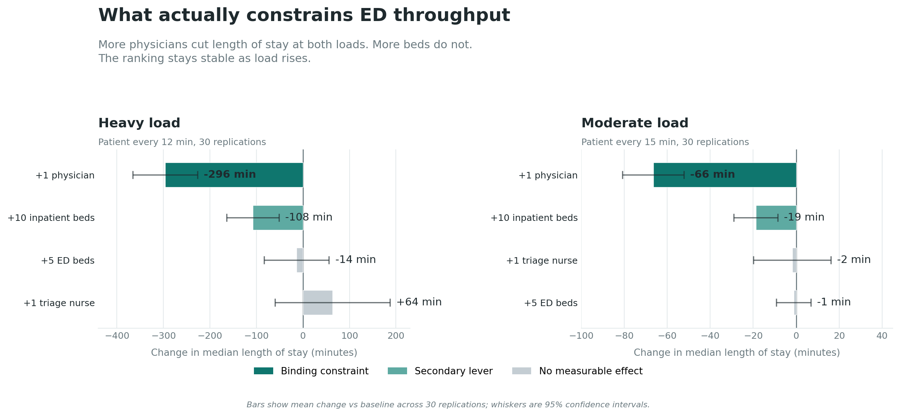

# ed-twin

A digital twin of a hospital emergency department: a software model accurate
enough to test operational changes before committing them in a real department.

The model answers a question hospitals actually argue about. When the ED is
crowded, what fixes it? The common answer is more beds. This model says
otherwise.

**[Try the live demo](https://ed-twin.vercel.app)** — drag the levers and watch what moves length of stay.



## The finding

Across simulated load, the binding constraint on throughput is **physician
capacity, not beds.** A single additional physician cuts median length of stay
by about five hours under heavy load. Five additional ED beds produce no
measurable change. The result holds at two different arrival rates and the
effect scales with load in the direction queueing theory predicts.

The point of the twin is that this conclusion is reached, and quantified with a
confidence interval, without touching a real department. Full method and
numbers are in [docs/bottleneck_analysis.md](docs/bottleneck_analysis.md).

## How it works

The model is a discrete event simulation of patient flow through the ED:
arrival, triage, bed placement, physician assessment, and either discharge or
admission with inpatient boarding. Patients carry an acuity level that drives
priority at each stage.

The analysis treats each scenario as a controlled experiment rather than a
single run:

- **Replications.** Each scenario runs across 30 seeded replications, so the
  comparison is between distributions, not single noisy weeks.
- **Common random numbers.** Every scenario sees the same set of arrival
  streams, so the paired difference isolates the intervention from seed luck
  and tightens the confidence intervals.
- **Confidence intervals.** Each effect is reported as a mean change with a 95%
  interval; an interval that excludes zero marks a real effect rather than
  noise.

This is what separates a working simulator from a usable decision tool: it does
not just describe the ED, it ranks the levers that change its throughput.

## Run it

From the project root with the virtual environment active:

```
# Compare baseline against a single intervention
python -m scripts.07_run_scenarios --beds 45

# Find the binding constraint: sweep every lever under load
python -m scripts.07_run_scenarios --sweep --load 12

# Repeat at a lighter load as a sensitivity check
python -m scripts.07_run_scenarios --sweep --load 15
```

Each run prints a comparison table and writes a tidy CSV to `data/scenarios/`.

## Interactive app

The web app under `web/` is a Next.js front end that reads a precomputed grid of
scenario results (generated by `scripts/08_generate_grid.py`). Because the full
analysis is computed offline, the app responds to slider changes instantly with
no backend. It is deployed at [ed-twin.vercel.app](https://ed-twin.vercel.app).

## Stack

Python, PostgreSQL, and SimPy for the simulation engine, pandas for metrics, and
a Next.js interactive layer deployed on Vercel.

## Data

The development pipeline is built on synthetic ED encounters from Synthea.
Final calibration uses MIMIC-IV-ED, the de-identified emergency department
dataset from PhysioNet (credentialing in progress).

## Status

Simulation engine, prescriptive scenario analysis, and interactive web app
complete and deployed at ed-twin.vercel.app. MIMIC-IV calibration in progress.

## Contact

**Sivakumar Reddy Yenna** Recent MS in Management Information Systems, Northern Illinois University

Open to **Business Analyst, BI Analyst, RevOps Analyst, Healthcare / Operations Analyst and Marketing Analyst** roles in the **Chicago metro area or anywhere in the US**.

- **Email:** <reddysivakumar1361@gmail.com>
- **LinkedIn:** [linkedin.com/in/sivakumar-reddy-yenna](https://www.linkedin.com/in/sivakumar-reddy-yenna)
- **Other projects:** [Logistics Analytics Dashboard](https://github.com/sivakumar-reddy/logistics-analytics) · [RevOps Customer Segmentation](https://github.com/sivakumar-reddy/revops-customer-segmentation)

